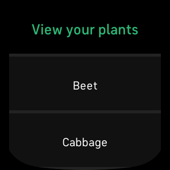
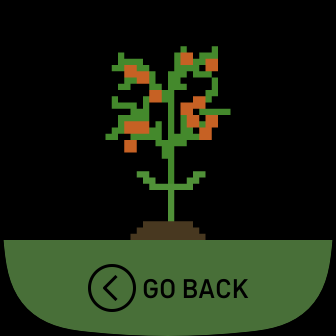

# Pocket Farm

Take care of your own personal, portable farm on your wrist with Pocket Farm. Every day, 17 different plants are planted in Pocket Farm, including beet, cabbage, carrot, corn, cucumber, eggplant, onion, peas, pepper, potato, pumpkin, radish, salad, spinach, tomato, watermelon and wheat. These plants will grow throughout the day based on the steps you take!  User's total daily steps are collected to calculate the growth of each plant in Pocket Farm.  All assets used can be found here: https://danaida.itch.io/

Supported Devices: Sense, Versa 3

Built with: Fitbit Studio (SVG, CSS3, JavaScript), Pixilart, Piskel

Fitbit App Gallery download link: https://gallery.fitbit.com/details/04c7038a-a1ab-492e-8bf5-0dfe165db4e5
